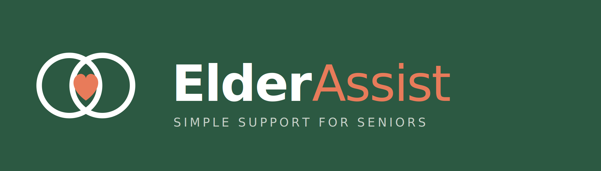
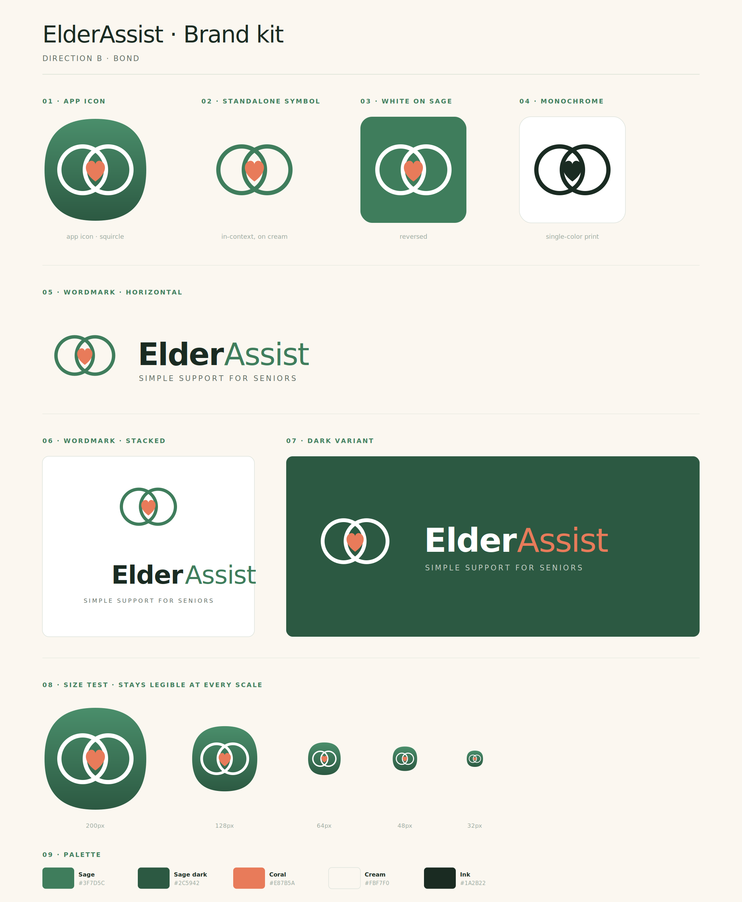
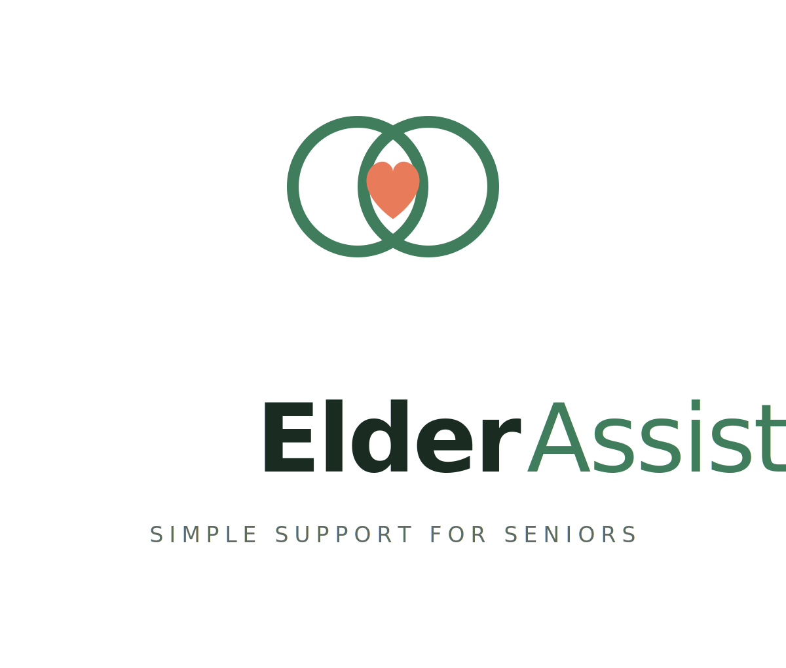

# ElderAssist

*Care has two sides · We hold both.*

<p align="center">
  
  <br>
  
</p>

## Introduction

This repository is part of our graduation project at **King Saud University**,  
College of Computer and Information Sciences — AlMuzahmiyah Campus,  
Applied Computer Science program, developed by:

* **Mubarak Albraik** (مبارك البريك) — 443170244
* **Mohammed Alsumaykhi** (محمد الصميخي) — 443100933
* **Abdullah Benjbr** (عبدالله بن جبر) — 443170266

**Supervised by:** Dr. Mohamed Maddeh

Together, we designed and built ElderAssist, a Flutter mobile application that supports elderly users and the people caring for them. The system was built around two coordinated roles — **Senior** and **Caregiver** — and uses Firebase for authentication, real-time data, push notifications, and serverless logic, with Vertex AI (Gemini) powering a conservative conversational health assistant.

This is the working repository for the project. The full report, including the system analysis, design diagrams, implementation walkthrough, and testing results, lives in **`docs/`** (add the PDF and diagrams there for grading or archival).

### Demo video

<p align="center">
  <a href="https://youtu.be/9bs-8XNaNOc" title="ElderAssist demo on YouTube">
    
  </a>
  <br>
  <a href="https://youtu.be/9bs-8XNaNOc"><strong>Watch the ElderAssist demo (YouTube)</strong></a>
</p>

### Brand reference

<p align="center">
  
</p>

<p align="center">
  
</p>

## What ElderAssist does

ElderAssist combines three things that usually live in separate apps:

* **Daily check-in.** A single “I'm okay today” button on the senior's home screen. If the senior does not check in before a configured cutoff, the caregiver is notified automatically.
* **Medication tracker.** Add medications and supplements, schedule multiple reminders per day, mark doses as taken, and track adherence. Caregivers can propose medications through the care chat for the senior to approve.
* **AI health assistant.** A conservative wellness coach powered by Gemini (Vertex AI), with explicit safety constraints — it does not diagnose, does not recommend stopping prescribed medication, and escalates clearly on emergency symptoms or signs of self-harm.

The interface was designed for elderly users from the ground up: large fonts, high-contrast colors, generous tap targets, and minimal on-screen complexity.

## Tech stack

**Mobile**

* Flutter (cross-platform mobile, Android first)
* Provider for state management
* `go_router` for navigation

**Backend (Firebase)**

* Firebase Authentication — phone + OTP and email + password
* Cloud Firestore — real-time NoSQL document database
* Firebase Storage — file uploads where the app uses storage
* Cloud Functions — server-side logic, including the AI assistant proxy
* Firebase Cloud Messaging — caregiver alerts and missed check-in pushes
* Firestore Security Rules — declarative access control (`firestore.rules`)

**AI**

* Vertex AI — Gemini model for the conversational health assistant
* System prompt deployed alongside the Cloud Function in `functions/ai_rules.txt`

**Tooling**

* Cursor IDE for code editing and refactoring assistance

## Repository layout

| Path | Purpose |
|------|--------|
| `lib/` | Flutter application source: `main.dart`, `core/` (routing, notifications, PIN), `features/` (auth, check-in, medication, chat, care chat, linking, profile, home, caregiver dashboard, …), `shared/` (theme, widgets, brand) |
| `android/`, `ios/`, `web/`, `windows/`, `linux/`, `macos/` | Platform runners and native configuration |
| `functions/` | Cloud Functions (Node 20): callable logic, Vertex AI integration, `ai_rules.txt` |
| `ElderAssist_brand_kit/` | Logos, symbol, wordmarks, and brand sheet (PNG/SVG) |
| `firebase.json` | Firebase project wiring (emulators, deploy targets) |
| `firestore.rules`, `storage.rules` | Security rules checked into the repo |
| `test/` | Flutter widget/tests |
| `docs/` | Graduation report, diagrams, and written analysis — see `docs/README.md` |

## Prerequisites

* [Flutter](https://docs.flutter.dev/get-started/install) (stable channel, SDK compatible with `pubspec.yaml`) — required to run the app after cloning.
* A [Firebase](https://firebase.google.com/) project with the products your build uses (Auth, Firestore, Storage, Functions, FCM, etc.).
* [Firebase CLI](https://firebase.google.com/docs/cli) if you work with emulators or deploy Functions.
* Node.js 20 for Cloud Functions (`functions/`).

## First time with Git & GitHub? (Windows)

These steps assume you’ve **never installed Git** and this is your **first time downloading code from GitHub**. If you already use Git, skip to [Local setup](#local-setup).

### 1. Create a GitHub account

1. Open **[github.com/signup](https://github.com/signup)** in your browser.
2. Choose a username, email, and password, and complete the sign-up flow.
3. **Confirm your email** when GitHub sends a verification message (check spam if you don’t see it).

### 2. Install Git on your computer

The **GitHub website** is where the repo lives in the cloud. **Git** is the program on your PC that **downloads** (“clones”) that repo to a folder you can open in Cursor, Android Studio, or VS Code.

1. Download **Git for Windows**: **[git-scm.com/download/win](https://git-scm.com/download/win)**.
2. Run the installer. For most people, the **default options** are fine (including “Git from the command line and also from 3rd-party software”).
3. When the installer finishes, close and reopen any open terminals.
4. Check that Git works: press **Win**, type **PowerShell**, open **Windows PowerShell**, then run:

   ```powershell
   git --version
   ```

   You should see something like `git version 2.43.0.windows.1`. If you get an error that `git` isn’t recognized, restart the PC and try again, or re-run the installer.

**Optional — GitHub Desktop (no command line):** If you prefer a graphical app, install **[GitHub Desktop](https://desktop.github.com/)**, sign in with your GitHub account, then use **File → Clone repository → URL**, paste the repository URL, pick a folder, and click **Clone**. After that, open that folder in your editor and continue from [Local setup](#local-setup) at **Install Flutter dependencies**.

### 3. Clone this repository (download the code)

If the repository is **private**, a team member must add your GitHub username under **Settings → Collaborators**. If it is **public**, you can clone without that.

**Using PowerShell (after Git is installed):**

1. Go to the folder where you want the project (example: your `Documents` folder):

   ```powershell
   cd $HOME\Documents
   ```

2. Clone (replace with the URL of this repo if different):

   ```powershell
   git clone https://github.com/alsumaykhi/ElderAssist.git
   ```

3. Enter the project folder:

   ```powershell
   cd ElderAssist
   ```

**Signing in:** The first time you `git clone` over HTTPS, Windows may open a **sign-in window** for GitHub. If it asks for a password, GitHub **does not** use your normal account password anymore. Use a **[Personal Access Token](https://docs.github.com/en/authentication/keeping-your-account-and-data-secure/creating-a-personal-access-token)** (classic token with **repo** scope) as the password, or complete the browser OAuth flow if Git Credential Manager offers it.

After this succeeds, you’ll have a full copy of the code on your machine at the path you chose (e.g. `Documents\ElderAssist`).

## Local setup

1. **Open the cloned folder** in your editor (the directory that contains `pubspec.yaml` — that’s the Flutter project root).

2. **Install Flutter dependencies**

   ```bash
   flutter pub get
   ```

3. **Firebase client config (required for a runnable app)**  
   We do **not** commit `lib/firebase_options.dart`, `android/app/google-services.json`, or `ios/Runner/GoogleService-Info.plist`. If you’re collaborating with us, we’ll send you these files over a **private** channel (please don’t put them in a public GitHub issue or gist). Place them in your clone at these **exact** paths:

   | File | Path in the repo |
   |------|------------------|
   | `firebase_options.dart` | `lib/firebase_options.dart` |
   | `google-services.json` | `android/app/google-services.json` |
   | `GoogleService-Info.plist` | `ios/Runner/GoogleService-Info.plist` *(only if you’re building iOS)* |

   Then run `flutter pub get` and `flutter run`. **Do not commit** these files—they stay local and are listed in `.gitignore`.

   If we change Firebase app registration, the Android `applicationId`, the iOS bundle ID, or move to another Firebase project, we’ll send **updated** copies. Until then, keep using the set we gave you.

4. **Run the app**

   ```bash
   flutter run
   ```

5. **Cloud Functions (optional)**  
   From the `functions/` directory:

   ```bash
   cd functions
   npm install
   ```

   Use `npm run serve` with the Firebase emulator if you’re working on Functions. We do not commit `.firebaserc` or service account JSONs; configure those locally only if you deploy from your machine.

## Firebase CLI deploy vs the config files we share

When we run `firebase deploy` (Functions, Firestore rules, indexes, Hosting, etc.), that updates **cloud** resources for our Firebase project. It does **not** change `firebase_options.dart`, `google-services.json`, or `GoogleService-Info.plist` on your computer. You keep using the copies we sent until we change client-side Firebase registration and give you new files. Pure backend deploys usually don’t require a new handoff.

## Security notes

* Do not commit signing keystores (`.jks`, `.keystore`), `key.properties`, or Google Cloud service account JSON files.
* Keep `.env` / `.env.local` out of git if you introduce them for secrets or endpoints.

## Repository name

The Flutter package name in `pubspec.yaml` may differ from this GitHub repository’s name. The product name is **ElderAssist**.
